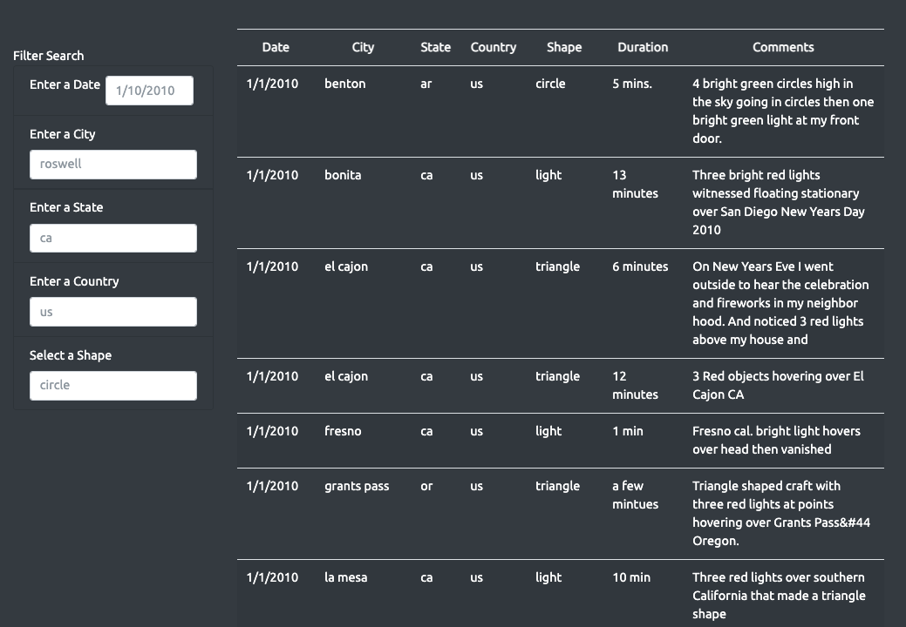
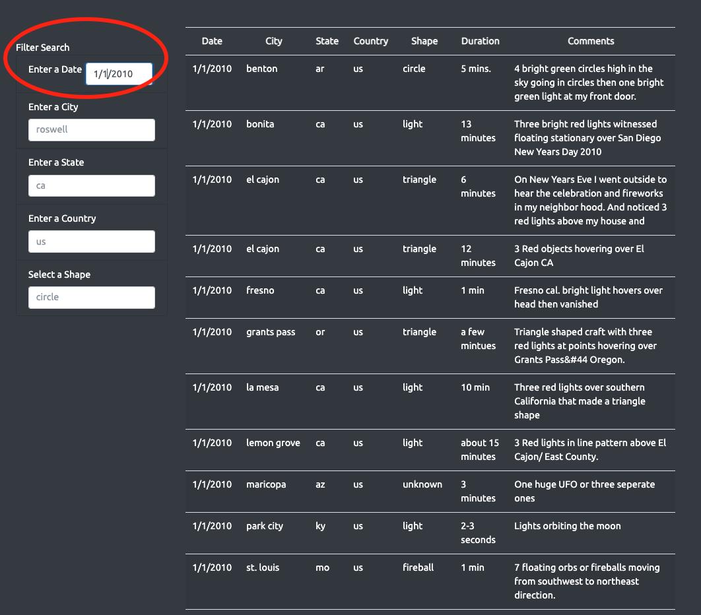
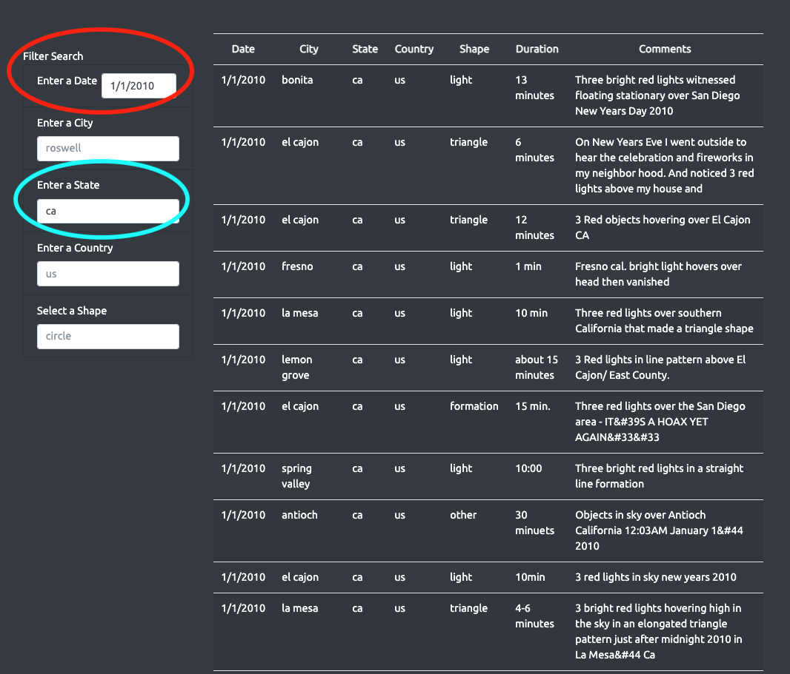
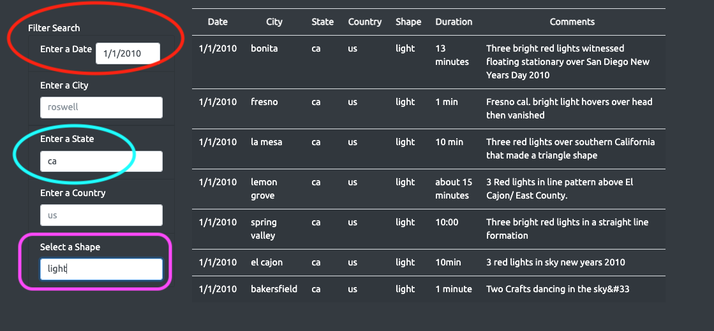
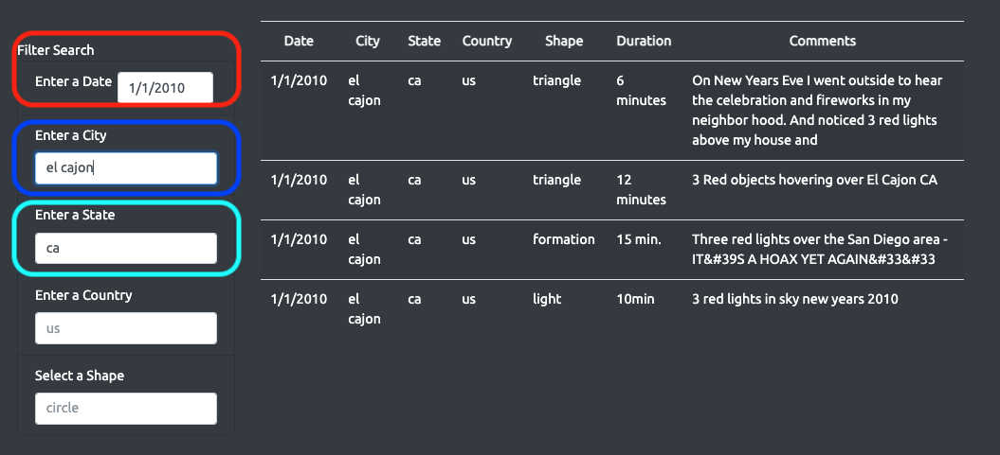
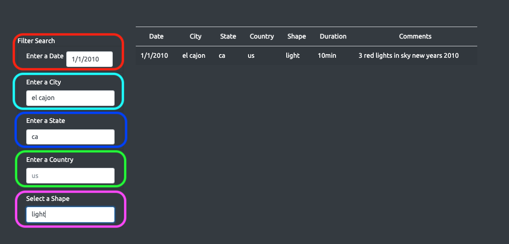

# UFOs
<<<<<<< HEAD
=======

>>>>>>> f70a0634cc3f0b4b6c3f66624368e0e5c967b80f
- An unidentified flying object (UFO) is an aerial phenomenon that cannot immediately be identified or explained. Most UFOs are identified on investigation as conventional objects or phenomena. The term is widely used for claimed observations of extraterrestrial spacecraft. 

## Overview of Project: 
- The purpose of this project is to analyse and compile data from different UFO encounters around the US and present them on one easy to use Webpage. This webpage is created using JavaScript, HTML/CSS. 

## Results: 
Below are few screenshots of filters which Dana can use from the new webpage using the search criteria. 
- ### Filters Image

- ### Webpage with UFO SightingsFacts or Fancy?

- ### Date Filter

- ### Date and State Filter

- ### Date, State and Shape Filter

- ### Date, City and Shape Filter

- ### Date, City, State, Country and Shape Filter

## Summary: 
- The webpage does give a great overview of UFO sightings in the US. It displays all the details in the form of a well structured table. This table can be filtered by the user input based on date, city , state, country and shape labels. The webpage has been well arranged and decorated using Bootstrap features and CSS. 
    - ### Drawback:
        - The biggest drawback is that it does not have functionality to add live data as it comes in.
        - The data used from the data file will stay same unless manually altered.

    - ### Recommendations:
        - Implement live data functionality rather than inputing the data manually.
        - To have ability to filter using duration of the sighting and buzz words from comments.
        - For further development and progress of the project we can add more data from different parts of the world.
<<<<<<< HEAD
        
=======
        

>>>>>>> f70a0634cc3f0b4b6c3f66624368e0e5c967b80f
